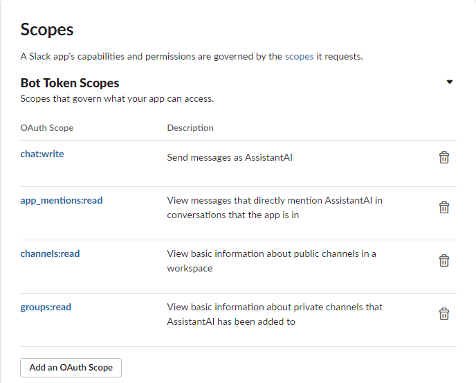
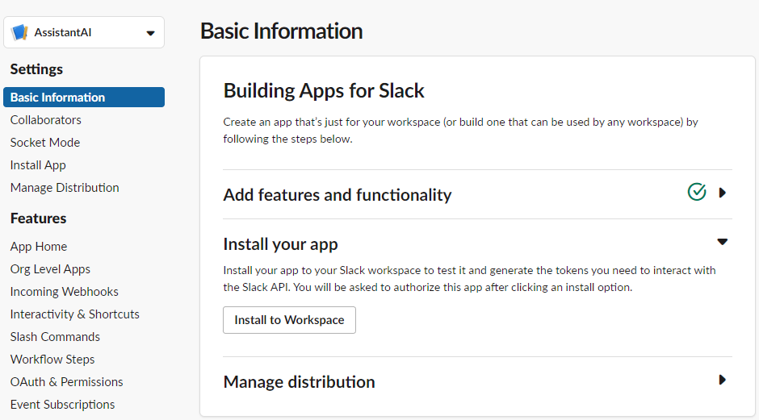
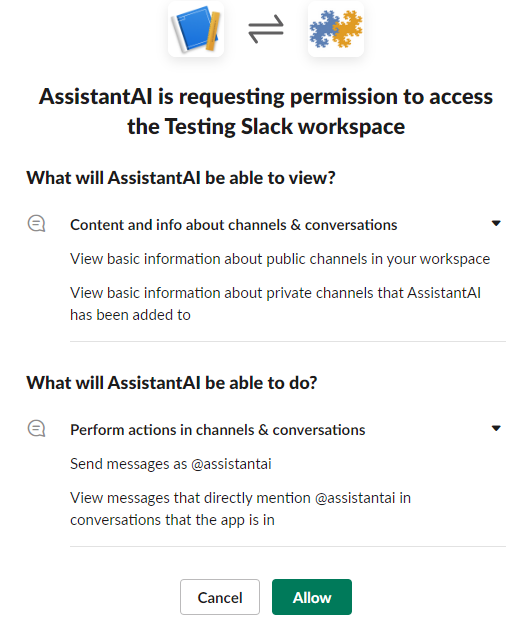
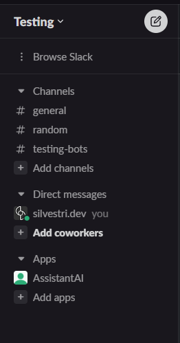
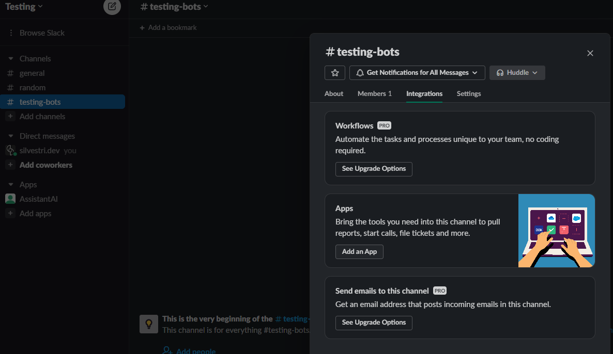
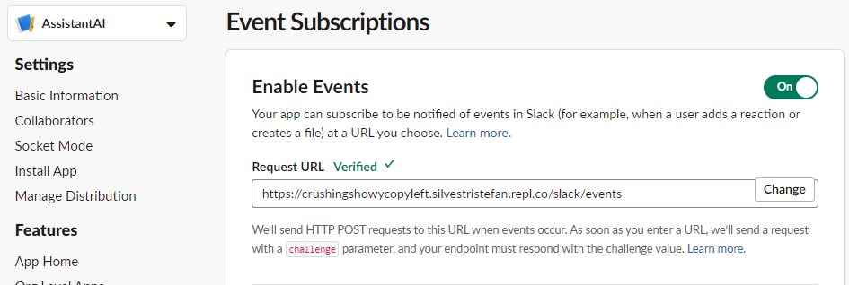
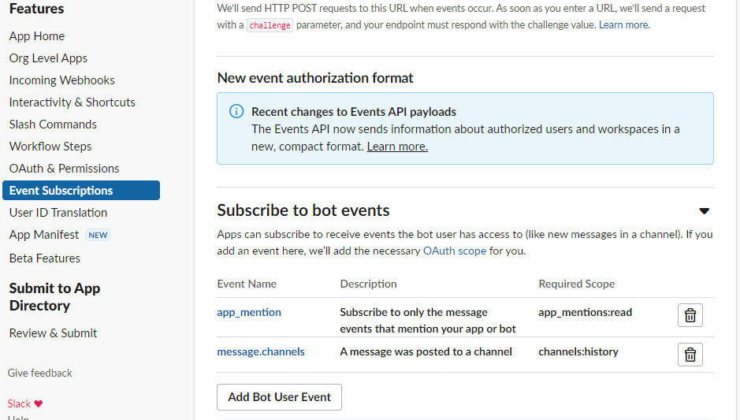

# How to install the AI Slack App

In this guide, it is assumed the web app has a valid url address.

## Steps
1. Go to [https://api.slack.com/apps](https://api.slack.com/apps). Log in. then click on the big green button "Create an App".
2. It will ask you if you want to create one from scratch or use a template. We will create one from scratch
3. Enter a name, say *AssistantAI*
4. Choose the workspace. Note that you can only select those in which you have access.
5. Click on the green button "Create".
6. Set permissions 
7. Install on workspace
8. Add the bot to the channels of your interest.
9. Connect the Web App to the bot

### Setting permissions
On the left menu select "OAuth & Permissions" under **Features**. Scroll down to the **Scopes** section. 
Add bot scopes. In our case we will give the following:
-  `chat:write`
-  `app_mentions:read`
-  `channels:read`
-  `groups:read`

### Install on workspace
On the left menu select "Basic Information" under **Settings**. Click on "Install to Workspace".

You will see a confirmation page in which it is summarized the app permissions and capabilities. Click on the green button "Allow".

Now the app is now installed on your workspace. You can check it on the left menu in your Slack application under "Apps"

### Add the bot to a channel
Right click on the channel of your interest and select "View channels details". Select the "Integrations" tab and select "Add an App". Select your app from the list.

### Connect the Web App to the bot
In [https://api.slack.com/apps](https://api.slack.com/apps) select your bot from the dropdown menu on the top left. 

Under **Features** select "OAuth & Permissions". Copy the OAuth Token for the Workspace and save it in the environment variable `SLACK_BOT_TOKEN`.

Under **Settings** select "Basic Information". Copy the "Signing Secret" in the **App Credentials** section and save it in the environment variable `SLACK_SIGNING_SECRET`.

Under **Features** select "Event Subscriptions". Toggle "Enable Events" (if it is not on already) and paste the url of your web app in the *Request Url* field and add the endpoint `/slack/event` (the endpoint is defined in the `SlackEventAdapter`) to it. You should see a green check mark and *Verified*

Scroll down to the **Subscribe to bot events** section and click "Add Bot User Event". Select `app_mention` and `message.channels` and click the green button on the bottom that says "Save changes". The last event that we added will require to reinstall your app because it requires more permission that we have given it, so do it. 

That's it! The app is now installed. Make sure you also retrieve the OpenAI API key and OpenAI Organization ID and save them in the `.env` file. 