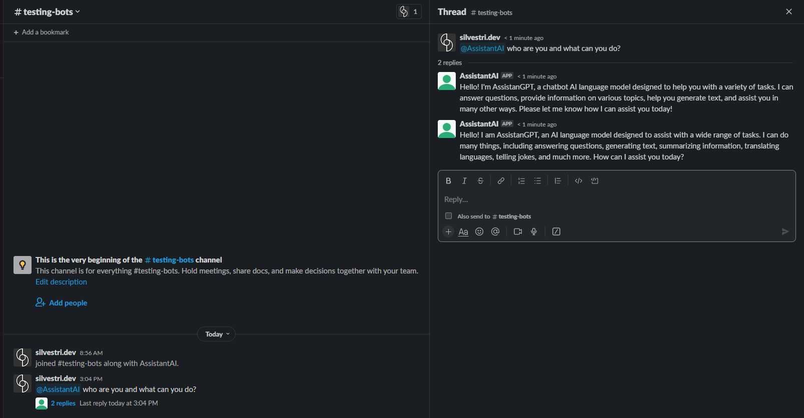
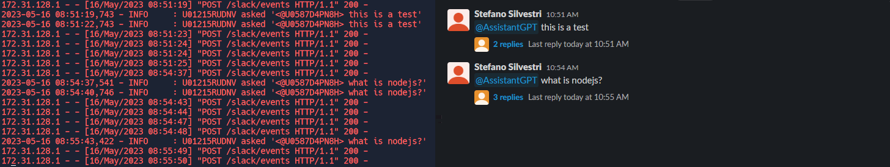
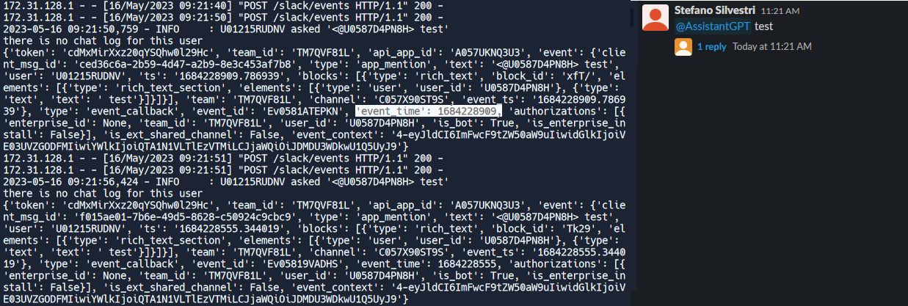

# ai-slack-app
An AI assistant as a Slack App

## How it works
This is a Flask web app so it must have a valid url. If you want to test it out locally you can use [ngrok](https://ngrok.com/).
I have tested it using [replit](replit.com) but without deploying it.

Once it is installed on your Slack channel simply mention the bot (in my case I called it *AssistantAI*, very clever I know) and it will respond to you in a thread. 

## References
To integrate the App on Slack I have mostly followed [DavidAtReplit guide](https://youtu.be/Rw84iRwFbJQ) but I modified it a little using the `slack-sdk` and `slackeventsapi` documentation.

## Issues [RESOLVED]
The code in `main.py` works fine, however as of 05/16/2023 it seems like the bot continues to answer to the same prompt without being asked to. I have not figured out the full reason for such a bug. 

I have tested it on another workspace with a different account. Notice first that a single message is sent twice, seconds apart. Furthermore it seems that it stops if I don't ask the assistant a question but give justa a statement "this is a test". However, if a question ("what is nodejs?") is asked it keeps answering minutes after it already. Note I did not send from Slack 5 messages but only 2.

Disabling the chatgpt response and just printing the `event_data` I get the following

Again the "event" was registered twice but there was only one response from the bot! what is going on?

Apparently if the call to OpenAI API takes longer than 3 seconds Slack resends the POST request. [see this issue on slackeventsapi](https://github.com/slackapi/python-slack-events-api/issues/84)

### UPDATE

It seems like I resolved it. It looks like it was an issue of acknowledging the message/event from Slack within the 3 seconds. 

Instead of using `slack-sdk` and `slackeventsapi` I switched to using  only `slack-bolt`. I created a new `main.py` and renamed the old one `old_buggy_main.py`.